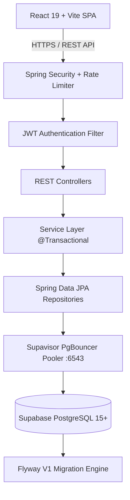
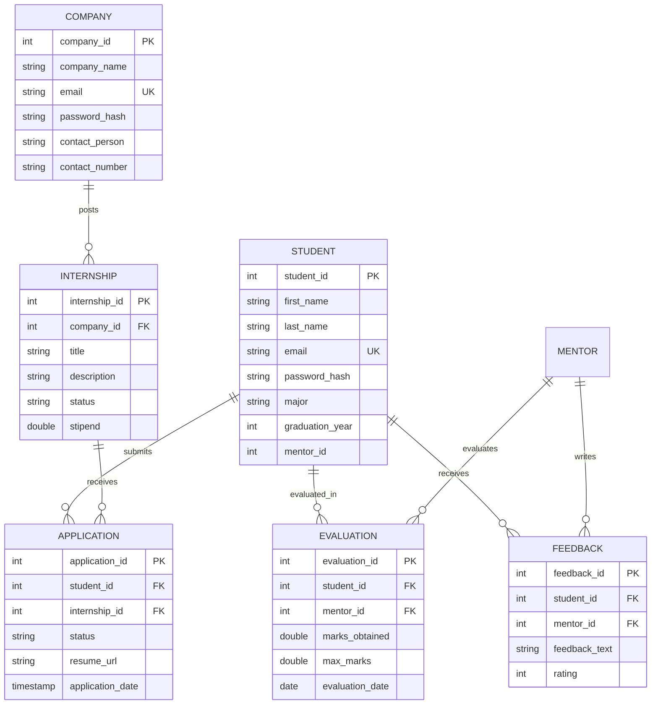

# 🚀 Campus Project & Internship Tracker Portal

[](https://spring.io/projects/spring-boot)
[-blue.svg)](https://supabase.com/)
[](https://react.dev/)
[](https://flywaydb.org/)
[](https://jwt.io/)
[](https://swagger.io/)

A full-stack, enterprise-grade academic platform designed to bridge the gap between **Students**, **Faculty Mentors**, and **Recruiting Companies**. Built with high performance, strict DBMS relational integrity, and production-hardened security standards.

---

## 🏛️ System Architecture



### Key Engineering Pillars
- **Layered Architecture**: Strict separation of concerns (`Controller` ➔ `Service` ➔ `Repository` ➔ `Model`) with explicit `@Transactional` boundary controls.
- **Fail-Fast Credential Strategy**: Zero default fallback passwords in source code. Credentials are dynamically injected via environment variables (`.env`).
- **Relational Integrity (3NF)**: Normalized relational schema managed via **Flyway** with `ddl-auto=validate` to avoid silent Hibernate schema drift.
- **N+1 Query Elimination**: Custom JPQL and derived query aggregations preventing Cartesian explosions and in-memory heap starvation.
- **Rate-Limited Authentication**: Sliding-window IP rate limiter defending against credential stuffing on auth endpoints.

---

## 📊 Database Design (DBMS Rigor)

The relational schema is in **Third Normal Form (3NF)**, enforcing strict referential integrity with foreign key cascades:



### Relational Indexing Strategy
To ensure sub-millisecond query execution on Supabase, the following indexes are maintained via Flyway (`V1__init_schema.sql`):
- `idx_internship_status`: Powers indexed filtering of active listings (`WHERE status = 'Active'`).
- `idx_internship_company_id`: Speeds up company internship dashboard lookups.
- `idx_application_student_id` & `idx_application_internship_id`: Enables instantaneous join resolution.
- `uk_student_internship`: Enforces a database-level composite uniqueness constraint preventing duplicate applications.

---

## 🔒 Security & System Design Trade-Offs (Interview Talking Points)

During technical interviews, software design is often about justifying trade-offs rather than claiming a system is universally perfect:

| Architecture Decision | Chosen Approach | Alternative Considered | Engineering Trade-Off & Rationale |
| :--- | :--- | :--- | :--- |
| **Token Storage** | `localStorage` + Request Interceptor | `httpOnly` secure cookies | `localStorage` provides ease of cross-domain SPA integration; trade-off is vulnerability to XSS, mitigated by sanitizing all UI inputs. A full production upgrade would use `httpOnly` cookies with CSRF tokens. |
| **Schema Evolution** | **Flyway** (`ddl-auto=validate`) | Hibernate `ddl-auto=update` | `ddl-auto=update` can silently alter column types, lock production tables, or fail unpredictably. Flyway ensures deterministic, reproducible, version-controlled schema across staging & prod. |
| **Resume Storage** | Authenticated File Streaming + Magic Bytes | AWS S3 Pre-signed URLs | Local streaming with UUID sanitization and `%PDF-` header validation keeps the system fully self-contained without external AWS costs. Production systems would offload to S3/Cloudinary. |
| **Brute Force Defense** | IP-based Sliding Window Limiter | Redis Distributed Token Bucket | In-memory `ConcurrentHashMap` with thread-safe timestamp queues provides zero-dependency protection against rapid automated brute-force attacks. Multi-instance clusters would use Redis. |
| **Query Aggregation** | Single SQL `COUNT` & `JOIN` | In-memory Java Stream `.filter()` | In-memory filtering pulls thousands of rows over the network, causing heap memory bloat (O(N) bandwidth). Moving counts into SQL utilizes DB indexing and returns a single scalar value (O(1) transfer). |

---

## 🛠️ API Documentation (Swagger / OpenAPI 3.0)

Interactive API documentation and schema explorer are enabled:
- **Swagger UI**: [http://localhost:8080/swagger-ui.html](http://localhost:8080/swagger-ui.html)
- **OpenAPI JSON Spec**: [http://localhost:8080/v3/api-docs](http://localhost:8080/v3/api-docs)

### Core REST Endpoints Summary

| Method | Endpoint | Description | Auth Required |
| :--- | :--- | :--- | :--- |
| `POST` | `/auth/register/{role}` | Register Student, Mentor, or Company (BCrypt hashed) | Public (Rate-limited) |
| `POST` | `/auth/login/{role}` | Authenticate user & receive 256-bit JWT token | Public (Rate-limited) |
| `GET` | `/internships` | Retrieve active internships (Indexed query) | Public |
| `POST` | `/internships` | Post new internship listing | Company |
| `POST` | `/applications` | Apply for an internship with resume | Student |
| `GET` | `/companies/{id}/analytics` | Retrieve single-query aggregated performance metrics | Company |
| `PUT` | `/companies/assign-mentor` | Persist mentor assignment to a student in DB | Company |
| `POST` | `/upload/resume` | Upload PDF/DOCX with UUID sanitization & magic-byte check | Student |
| `GET` | `/upload/resume/{fileName}` | Stream resume content with proper MIME header | Authenticated |

---

## 🚀 Setup & Execution Guide

### Prerequisites
- **Java 17+** (JDK)
- **Node.js 18+** & npm
- Access to **Supabase PostgreSQL** (or local PostgreSQL)

### 1. Environment Configuration
Create a `.env` file in the root project directory:
```env
SPRING_DATASOURCE_URL=jdbc:postgresql://<SUPABASE_HOST>:6543/postgres?sslmode=require&prepareThreshold=0
SPRING_DATASOURCE_USERNAME=<SUPABASE_USER>
SPRING_DATASOURCE_PASSWORD=<SUPABASE_PASSWORD>
JWT_SECRET=your_256_bit_cryptographically_secure_random_hex_secret_key_here
ALLOWED_ORIGINS=http://localhost:5173
```

### 2. Run Backend (Spring Boot)
```bash
# Windows PowerShell
.\mvnw.cmd spring-boot:run

# Linux / macOS
./mvnw spring-boot:run
```
*Flyway will automatically execute `V1__init_schema.sql` on first boot and Hibernate will validate the schema.*

### 4. Run with Docker Compose
```bash
docker compose up --build
```
Access frontend at `http://localhost` and backend at `http://localhost:8080`.

### 5. Reproducible Benchmarking
Run the automated Caffeine cache benchmark to measure real cold vs warm latencies:
```bash
python scripts/benchmark_cache.py
```

### 6. Production Health & Telemetry (Actuator)
- **Public Health Probe**: `GET /actuator/health` (returns `{"status":"UP"}`)
- **Authenticated Metrics**: `GET /actuator/metrics` (requires `Authorization: Bearer <token>`)

---

## 👨‍💻 Author & Acknowledgements
- Developed by **Someshwar Joshi** for DBMS Course-Based Project & Resume Portfolio.
- Built to industry engineering guidelines: 3NF schema, Flyway versioning, stateless JWT, Caffeine in-memory caching, and multi-stage Docker builds.

